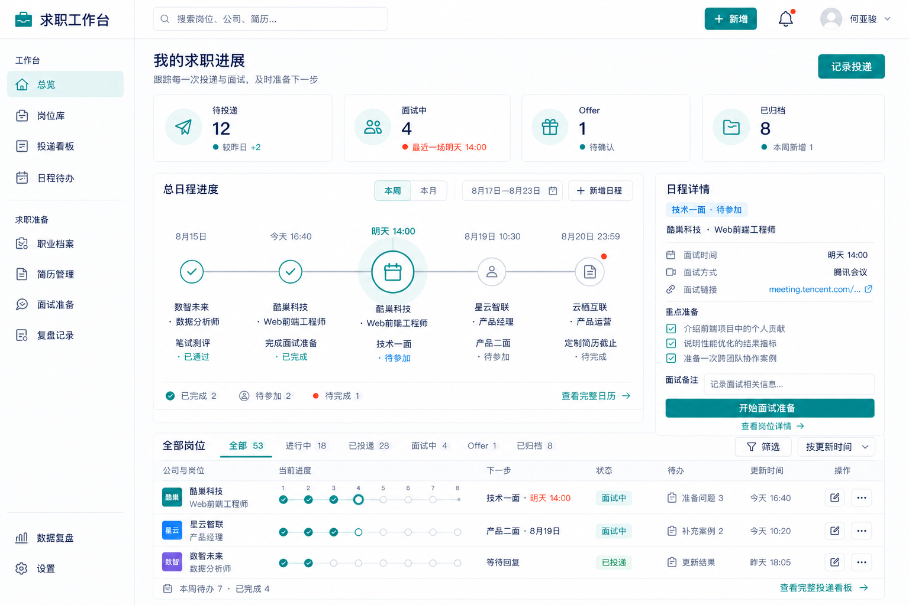

# 秋招求职工作台 UI 设计文档

## 1. 文档信息

| 项目 | 内容 |
| --- | --- |
| 文档版本 | V0.6 |
| 对应产品文档 | 《秋招求职工作台产品需求文档 V0.5》 |
| 设计范围 | Web 工作台 + 浏览器插件侧边栏/页面浮窗 |
| 首版方向 | 技术研发、产品、数据与算法、运营、设计 |
| 参考风格 | 浅色专业工作台、BOSS 场景协调青绿、深蓝信息层级、细边框卡片、紧凑信息布局 |
| 插件文档 | [浏览器插件功能与技术设计文档](./浏览器插件功能与技术设计文档.md) |
| 决策记录 | [产品决策记录](./产品决策记录.md) |
| 更新日期 | 2026-08-18 |

## 2. 视觉参考


插件首轮效果图作为 Web 工作台的直接设计基线：

- [当前岗位](./UI效果图/插件/01-当前岗位.png)
- [匹配结果](./UI效果图/插件/02-匹配结果.png)
- [收藏完成](./UI效果图/插件/03-收藏完成.png)
- [识别失败](./UI效果图/插件/04-识别失败.png)

效果图用于确定视觉语言，后续已实现并确认的浮窗、匹配卡片和 Web 页面决策优先于早期效果图。插件固定采用单列纵向布局，默认承载于页面浮窗，浏览器侧边栏为设置中的备选方式；文档中的尺寸、状态和交互说明用于补充效果图。

本项目借鉴参考图的视觉语言，不复制其具体内容和数据：

- 左侧固定导航，顶部使用全局搜索和快捷操作。
- 页面背景接近白色，以边框和轻微色差区分层级。
- 青绿色作为主操作与连接色，与 BOSS 直聘使用场景协调；深蓝色承担导航、标题和高层级信息。
- 珊瑚橙只用于薪资、风险和少量数据强调，避免与青绿色形成大面积竞争。
- 数据卡片、看板和列表具有较高的信息密度。
- 使用轻圆角、细边框和极弱阴影，保持专业、克制。
- 关键数字醒目，说明文字弱化，状态通过色点和标签表达。
- 页面强调“工作台”而非营销网站，减少大面积插画和装饰。

## 3. 设计目标

### 3.1 设计关键词

```text
清晰、可信、专业、轻量、克制、高效、有秩序
```

### 3.2 用户感受

- 打开后能迅速理解今天应该做什么。
- 信息很多但不压迫，重要内容有明确层级。
- AI 生成内容可以追溯、确认和修改，不显得不可控。
- 求职进展和材料集中在一个稳定、可靠的空间中。
- 插件像 Web 工作台的延伸，而不是独立的小工具。

### 3.3 设计原则

1. **行动优先**：每个页面突出一个主要行动，避免多个同等级按钮竞争。
2. **事实优先**：职业档案中区分用户事实、AI 推断和生成表达。
3. **状态清晰**：岗位、卡片、简历和面试始终显示当前状态。
4. **渐进展开**：默认展示摘要，需要时再展开复杂字段。
5. **高密度但不拥挤**：通过网格、留白和弱分割线承载更多信息。
6. **跨端一致**：插件和 Web 使用同一套青绿主色、深蓝层级色、字体、状态与组件语言。
7. **场景协调但保持独立**：可以与招聘平台的青绿色环境形成视觉连接，但不复制 BOSS 标志、组件结构或品牌图形。

## 4. 信息架构与导航

### 4.1 Web 主导航

左侧导航宽度固定，分为四组：

```text
工作台
├── 总览
├── 求职工作流
├── 岗位库
├── 投递看板
└── 日程待办

求职准备
├── 职业档案
├── 简历管理
├── 面试准备
└── 复盘记录

个人资产
├── 作品与附件
└── 资料库

系统
├── 数据复盘
└── 设置
```

首版可以隐藏空模块，避免导航过长。建议 P0 显示：总览、求职工作流、岗位库、投递看板、职业档案、简历管理、面试准备、设置。

### 4.2 顶部栏

顶部栏固定，包含：

- 产品名称与当前页面。
- 全局搜索：支持搜索岗位、公司、简历、经历卡片和面试记录。
- “新增”按钮：岗位、经历卡片、简历、面试记录。
- 待办与通知。
- 用户头像及账号菜单。

### 4.3 浏览器插件导航

插件首版不设复杂导航，只保留：

- 当前岗位。
- 收藏结果。
- 打开工作台。
- 用户账号入口。

## 5. 设计系统

### 5.1 色彩

#### 基础色

| Token | 建议色值 | 用途 |
| --- | --- | --- |
| `--color-primary-700` | `#087F7A` | 主按钮按下、选中状态、重点描边 |
| `--color-primary-600` | `#00A6A0` | 主按钮、链接、主要图表线 |
| `--color-primary-500` | `#00B8B0` | 图标、状态点和轻量品牌强调 |
| `--color-primary-100` | `#E6F7F6` | 选中导航、浅色提示背景、图标底色 |
| `--color-navy-800` | `#17324D` | 左侧导航、页面标题、核心数字 |
| `--color-navy-600` | `#38526B` | 次级标题、深色图标 |
| `--color-accent-coral` | `#FF7657` | 薪资、风险缺口和少量关键强调 |
| `--color-bg-page` | `#F6F8FB` | 页面背景 |
| `--color-bg-panel` | `#FFFFFF` | 卡片、侧栏、顶部栏 |
| `--color-text-primary` | `#17324D` | 标题、关键数字 |
| `--color-text-secondary` | `#596579` | 正文和辅助信息 |
| `--color-text-tertiary` | `#8B95A5` | 时间、说明、占位符 |
| `--color-border` | `#E3E9EF` | 默认边框和分割线 |
| `--color-border-strong` | `#D6DDE6` | 悬停和重点边框 |

#### 语义色

| 状态 | 建议色值 | 使用场景 |
| --- | --- | --- |
| 成功 | `#159A76` | 已完成、Offer、已确认 |
| 提醒 | `#B7791F` | 待处理、待确认、即将截止 |
| 风险 | `#E65B4F` | 信息冲突、硬性条件不符 |
| 信息 | `#3478B8` | 进行中、普通提示 |
| 中性 | `#7B8798` | 已结束、已隐藏、次要状态 |

颜色只作为状态的辅助表达，必须同时配合文字或图标，不能仅依赖颜色传达信息。

主色使用比例建议：页面中性背景与白色面板约占 80%，深蓝信息层级约占 12%，青绿色操作与状态约占 6%，珊瑚橙及其他语义色合计不超过 2%。禁止使用青绿到蓝紫的大面积品牌渐变。

### 5.2 字体

字体栈：

```css
font-family: Inter, "SF Pro Display", "PingFang SC",
  "Microsoft YaHei", system-ui, sans-serif;
```

| 层级 | 字号/行高 | 字重 | 用途 |
| --- | --- | --- | --- |
| 页面标题 | 24/34 | 650 | 页面主标题 |
| 模块标题 | 18/26 | 600 | 卡片区块标题 |
| 卡片标题 | 15/22 | 600 | 岗位、经历卡片标题 |
| 正文 | 14/22 | 400 | 默认内容 |
| 辅助文字 | 12/18 | 400 | 状态说明、时间、来源 |
| 核心数字 | 28/34 | 650 | 仪表盘统计 |

中文正文避免使用过细字重。核心数字使用等宽数字特性，减少数据跳动。

### 5.3 间距

使用 4px 基础栅格：

```text
4：图标与文字微间距
8：标签和紧凑元素间距
12：卡片内部紧凑间距
16：默认组件间距
24：模块间距
32：页面区块间距
```

### 5.4 圆角与阴影

| 元素 | 圆角 |
| --- | --- |
| 按钮、输入框、标签 | 6—8px |
| 普通卡片 | 10px |
| 大模块容器 | 12px |
| 插件面板 | 12px |

默认卡片以边框为主，不使用明显阴影：

```css
box-shadow: 0 1px 2px rgba(21, 32, 51, 0.04);
```

悬停时可以增强为：

```css
box-shadow: 0 6px 18px rgba(21, 32, 51, 0.08);
```

### 5.5 图标

- 平台品牌位置统一使用已确定的第二版平台 Logo，Web 资源为 `apps/web/public/brand-logo.png`，插件资源为 `apps/extension/assets/logo-concept-v2.png` 与工具栏版本 `logo-toolbar-v2.png`。
- 功能操作图标采用 Apple SF Symbols 的语义与轻量视觉语言，例如位置、工作、学历、收藏、分析、隐私、收起和关闭；不得再用文字 Logo、Emoji、地图缩略图或任意网站图片替代功能图标。
- macOS/Safari 环境优先使用系统可用符号；Web、Windows 与其他浏览器使用获得授权且视觉一致的矢量替代，不直接重新分发受限制的 Apple 字形资源。
- 默认尺寸为 18px，紧凑操作为 15—16px；同一组件内保持统一线宽和光学尺寸。
- 高频状态使用“图标 + 文字”，纯图标按钮必须提供悬停提示和辅助标签。

## 6. 页面框架

### 6.1 桌面布局

```text
┌────────────┬──────────────────────────────────────────────┐
│            │ 顶部搜索 / 新增 / 通知 / 用户                │
│ 左侧导航   ├──────────────────────────────────────────────┤
│ 216px      │                                              │
│            │ 页面标题与操作                               │
│            │                                              │
│            │ 主内容区                                     │
│            │                                              │
└────────────┴──────────────────────────────────────────────┘
```

- 左侧导航：216px。
- 顶部栏：64px。
- 主内容最大宽度：1440px。
- 页面水平内边距：24—32px。
- 页面最小支持宽度：1024px。

### 6.2 响应式策略

- `≥ 1280px`：完整左侧导航和多列仪表盘。
- `1024—1279px`：收窄侧栏，数据卡片自动换行。
- `< 1024px`：首版提示使用桌面端，不强行适配复杂看板。

## 7. 核心页面设计

### 7.1 五分钟建档

#### 页面目标

让用户在五分钟内形成可用于岗位匹配的基础职业档案，并明确可以稍后继续完善。

#### 流程

```text
选择方向 → 选择建档方式 → 简历解析/手动添加 → 确认关键卡片 → 完成
```

#### 方向选择

- 五个一级方向以图标卡片展示：技术研发、产品、数据与算法、运营、设计。
- 用户选择一个主方向和最多两个备选方向。
- 卡片选中后使用浅青绿背景、青绿边框和勾选图标。
- 不要求首次选择具体到所有二级岗位，可以稍后修改。

#### 建档方式

主操作为“上传简历快速建立”，次操作为“从零手动添加”。

上传区域支持 PDF、DOC、DOCX，展示隐私说明：

> 简历仅用于建立你的职业档案，不会对外发送。所有信息均需你确认后才会参与内容生成。

#### 解析确认

- 页面顶部显示解析摘要：共生成多少张卡片、多少张可批量确认、多少张需要处理。
- 高置信度卡片默认进入批量确认区。
- 低置信度和冲突卡片单独置顶，使用黄色或红色提示边框。
- 用户可以展开原文来源进行对照。
- 页面底部固定操作栏：“确认并完成建档”“继续深度完善”。

### 7.2 总览驾驶舱



#### 首屏结构

```text
问候与阶段摘要
核心数字卡片
总日程进度         日程详情
全部岗位与进度
```

#### 核心数字卡片

建议展示五张：

- 待投递。
- 已投递。
- 在面试。
- Offer。
- 本周待办。

卡片包含小状态点、标题、核心数字和一句解释。避免把“匹配分”或“薪资”作为固定核心数据，用户投递阶段不同，价值不一致。

#### 总览页色彩分工

- 左侧导航以白色或极浅灰为底，当前导航使用浅青绿底和深青绿文字，不使用整块深色侧栏。
- 页面标题、模块标题和核心数字统一使用深蓝；青绿色仅强调主操作、进度和当前状态。
- 投递阶段使用低饱和语义色区分，卡片主体保持白色，避免整卡着色。
- 珊瑚橙优先用于薪资、岗位硬性缺口和需要立即关注的单个数字，不用于普通按钮。
- 图表以青绿为主序列、深蓝为次序列，灰色承担历史或未完成数据。

#### 总日程进度

- 总览页不默认指定“重点岗位”，而是按时间聚合所有岗位的近期事件。
- 每个日程节点必须同时显示公司、岗位和当前环节，例如“酷巢科技 · Web 前端工程师 · 技术一面”。
- 时间轴支持本周、本月切换，区分已完成、待参加和待完成状态。
- 选中日程后，右侧展示对应环节的时间、方式、链接、准备清单和备注。
- 时间轴下方保留“查看完整日历”入口；完整岗位阶段管理仍在投递看板中完成。

#### 全部岗位与进度

- 以紧凑表格展示公司与岗位、当前进度、下一步、状态、待办和更新时间。
- 当前进度使用小型节点轨道，帮助用户快速比较不同岗位所处阶段。
- 支持按进行中、已投递、面试中、Offer 和已归档筛选。

#### 方向准备度

显示主方向和备选方向的准备度：

```text
产品经理  82%  缺少上线后业务指标
产品运营  65%  缺少增长结果证据
数据分析  41%  缺少 SQL 项目证据
```

进度条只表达素材准备程度，不表达录用概率。

### 7.3 职业档案

#### 页面结构

```text
页面标题 / 新增卡片 / 上传简历
个人信息
方向准备度与补充建议
筛选栏
经历时间线或卡片网格
```

支持两种视图切换：

- 时间线：教育、实习、工作、项目和校园经历。
- 卡片网格：技能、证书、作品、优势及全部素材。

#### 个人信息栏

- 位于职业档案内容最前方，以独立卡片展示姓名、电话、邮箱、所在城市和求职状态。
- 提供“编辑个人信息”和“添加更多字段”，可选择填写照片、出生年月、性别、政治面貌、籍贯、期望城市、个人主页、GitHub、作品集和自定义联系方式。
- 敏感或非必要字段默认收起，并分别设置是否允许用于简历；不得因字段为空制造大面积空表单。
- 页面品牌位使用平台第二版 Logo，字段与操作图标遵循统一的 SF Symbols 语义映射。

#### 卡片视觉结构

```text
┌──────────────────────────────────────┐
│ [项目经历] 校园二手交易小程序   ··· │
│ 产品负责人 · 2025.03—2025.06         │
│                                      │
│ 访谈20名用户，完成需求分析与原型……  │
│                                      │
│ 用户研究  产品设计  项目管理         │
│                                      │
│ ✓ 已确认   来源：基础简历.pdf         │
│ 可用于简历                            │
└──────────────────────────────────────┘
```

卡片需要显示：

- 类型、标题、组织、角色和时间。
- 一段摘要，不直接显示全部事实。
- 已确认能力标签。
- 确认状态和来源。
- 使用范围。
- 展开、编辑、隐藏操作。

#### 状态设计

| 状态 | 视觉表现 |
| --- | --- |
| 已确认 | 绿色勾选图标 + 中性卡片 |
| 待确认 | 黄色状态点 + 浅黄标签 |
| 待完善 | 蓝色提示 + “补充信息”操作 |
| 信息冲突 | 红色警示图标 + 红色顶部细条 |
| 完全隐藏 | 卡片降低透明度，但内容仍可阅读 |

#### AI 推荐标签

AI 推荐标签使用虚线边框和“AI 建议”标记：

```text
[数据分析 · AI建议]  [项目管理 · AI建议]
```

用户点击后选择确认、修改或删除。未确认标签不得与普通标签混在一起。

#### 使用范围

卡片右上角提供可见范围菜单：

- 可用于简历。
- 仅用于面试。
- 完全隐藏。

修改后使用轻提示说明影响范围，不使用阻断式弹窗。

### 7.4 岗位库

#### 列表字段

- 职位与公司。
- 所属方向。
- 城市与薪资。
- 匹配建议。
- 当前状态。
- 收藏时间。
- 最近动作。

默认使用高密度表格或列表，支持切换卡片视图。匹配建议展示为三级：优先投递、有条件投递、暂不建议，不只显示抽象数字。

#### 岗位详情

岗位详情采用左右布局：

```text
左侧 65%                         右侧 35%
原始 JD / JD 解读                匹配摘要
职责与要求                       已匹配经历
公司与岗位信息                   能力缺口
                                 投递准备操作
```

右侧保持吸顶，突出“生成投递材料”。所有判断都可以展开查看依据。

从岗位列表打开的收藏详情采用接近桌面工作区宽度的大弹窗，而不是窄阅读弹窗。建议宽度 1100—1180px、高度不超过视口，顶部固定岗位、公司和薪资，底部固定删除、打开原职位和完成操作；中间滚动区依次展示：

1. 地点、经验、学历和福利标签。
2. AI 匹配度与投递建议。
3. AI 总结“这个岗位做什么”。
4. 已匹配能力和需要确认/改进项。
5. 主要工作内容与岗位要求双栏。
6. 可展开的原始 JD。

移动端改为单列，匹配度卡片从纵向圆环调整为横向摘要，底部保留主要操作。

岗位标题下方增加五阶段工作流轨道：

```text
岗位分析 → 投递准备 → 正式投递 → 面试准备 → 面试复盘
```

- 当前阶段使用青绿色实心节点，已完成使用勾选，未开始使用灰色空心节点。
- 轨道下方只突出一个“建议下一步”，避免同时出现多个同级主按钮。
- 点击阶段切换下方内容区域，不跳离当前岗位上下文。
- 每个完成状态可展开查看来源，例如“已下载简历”“用户标记已投递”。

### 7.5 投递看板

使用横向看板：

```text
待准备 → 待投递 → 已投递 → 笔试 → 面试 → Offer / 已结束
```

- 列宽保持一致，支持横向滚动。
- 岗位卡显示标题、公司、截止时间、优先级和下一步动作。
- 拖动改变状态时，记录操作时间。
- Offer 和已结束可以折叠，减少长期数据占用空间。

### 7.6 简历管理

#### 页面结构

简历管理入口默认是简历列表页，不直接进入创建或编辑器：

```text
页面标题 / 创建简历
筛选与搜索
基础简历
岗位专属简历列表
```

- 每条简历展示名称、关联岗位与公司、版本状态、更新时间和最近导出时间。
- 支持直接预览现有简历、复制版本、继续编辑和归档。
- 用户点击“创建简历”后进入素材选择与岗位选择页面；生成完成后才进入编辑页面。
- 编辑页面采用三栏：左侧为结构与素材，中间为简历编辑/预览，右侧为岗位匹配建议、事实来源和待确认内容。

#### 事实溯源

选中一条简历表述时，右侧显示：

- 来源经历卡片。
- 使用的原始事实。
- AI 做了哪些改写。
- 是否包含待用户确认内容。

生成内容状态：

- 绿色：来自已确认事实。
- 黄色：基于待完善事实，需要确认。
- 红色：缺少充分依据，不建议使用。

#### 导出

导出按钮包含：PDF、长图、分页图片。导出前显示文件名和页面预览，不直接触发下载。

### 7.7 面试准备

采用“准备清单 + 问题卡片”的布局：

- 岗位理解。
- 自我介绍。
- 经历追问。
- 专业问题。
- STAR 案例。
- 反问问题。

问题卡支持：未准备、准备中、已完成。展开后显示回答、关键词提纲、关联经历卡片和用户笔记。

#### 三层问题树

问题区使用分组树结构：

```text
通用问题
├── 自我介绍
└── 求职动机

岗位与业务问题
├── JD 核心能力
└── 公司业务场景

经历深挖
└── 项目 A
    ├── 你的具体角色是什么？
    ├── 为什么采用这个方案？
    └── 如何证明结果有效？
```

- 问题卡显示来源标签：JD、职业档案或公司公开资料。
- 经历深挖问题显示关联卡片，用户可以一键查看事实原文。
- 回答区提供快捷指令：“更口语化”“压缩到一分钟”“改为 STAR”“补充证据”“继续追问”。
- AI 对话与事实编辑分区展示，避免用户误以为生成回答已经写入职业档案。

### 7.8 岗位工作流与投递准备清单

岗位工作流页面适合跨岗位查看，使用“阶段摘要 + 下一步任务列表”；岗位详情中的工作流适合单岗位连续操作，两者共享状态。

投递准备卡片包含：

- JD 解读与匹配分析。
- 招呼语生成、确认和复制状态。
- 定制简历生成、确认和下载状态。
- 外部平台投递确认。

完成项折叠，未完成项按优先级排列。准备度用环形进度或细进度条表达，并明确标注“材料完成度”。

### 7.9 面试复盘（P1）

页面采用“原始记录—AI 诊断—优化回答”三栏或三个页签：

1. 原始记录：用户手动输入问题，或主动上传有权处理的录音。
2. AI 诊断：展示是否切题、结构、证据、表达长度和具体问题片段。
3. 优化回答：保留原回答与修改版本对照，并提供“加入题库”“添加改进任务”。

上传录音前展示隐私和授权确认；转写完成后允许删除原始音频，仅保留用户确认的文字内容。系统不得在后台自动录音。

## 8. 浏览器插件侧边栏与页面浮窗

### 8.1 尺寸

- 页面浮窗默认尺寸：420 × 620px。
- 允许拖动右下角调整大小；调整过程按动画帧更新外框并暂停 iframe 内容重排，松手后再恢复内容布局，避免卡顿。
- 最小宽度：360px。
- 主内容使用单列纵向布局，不划分左右栏。
- 面板内边距：20—24px；卡片内边距：16—20px。
- 顶部栏高度：64px。

插件默认使用招聘页面内浮窗，浏览器原生 Side Panel 为设置中的备选方式。浮窗使用 Shadow DOM 与 iframe 隔离招聘页面样式，并提供收起和关闭两个独立操作：收起后保留横向会议软件风格悬浮栏，关闭后完全隐藏。悬停、首次移入和岗位切换均不自动展开，只有点击横栏才展开。

浮窗与收起栏共用同一个位置和拖动锚点。顶部 `•••` 把手始终水平居中，展开或收起时其屏幕位置保持不动；面板可以大部分拖到画面外为招聘页面腾出空间，但 `•••` 可拖动部分必须完整留在视口内。收起栏和展开浮窗都可拖动，位置与尺寸持久化。

### 8.2 识别成功

```text
┌─────────────────────────────────────┐
│ 求职工作台              ● 已连接 头像│
├─────────────────────────────────────┤
│ 当前岗位 · BOSS直聘                 │
│ ┌─────────────────────────────────┐ │
│ │ Web前端工程师            8—13K  │ │
│ │ 酷巢科技 · 杭州 · 1—3年 · 本科  │ │
│ │ AI 岗位总结                       │ │
│ │ [收藏岗位]      [分析匹配]       │ │
│ └─────────────────────────────────┘ │
│ 最近收藏                    查看全部│
│ [岗位一] [岗位二] [岗位三]          │
│              打开完整工作台 →       │
└─────────────────────────────────────┘
```

- 收藏前展示职位、公司、地点、薪资和方向五项关键信息。
- 职位图标优先展示从 BOSS 职位页提取的公司 Logo；加载或提取失败时回退为青绿色通用职位图标。公司名称始终以文字显示，不能只依赖 Logo 识别。
- 用户可以修正系统识别的岗位方向。
- 薪资胶囊与岗位名称顶线对齐，保留足够左右内边距和不换行空间，不得挤压岗位标题或让价格文字贴边。
- “收藏岗位”为青绿色主按钮；“分析匹配”默认使用灰色待分析状态，只有用户主动点击后才进入分析中和结果状态。两者保持独立。
- 插件打开期间切换到新岗位时自动在本地更新主状态区摘要。
- 两个按钮相互独立：收藏不自动分析，分析不自动收藏。
- 未点击任何操作前不上传 JD；点击分析时明确提示将使用岗位信息和个人职业档案进行匹配。

### 8.3 分析完成

```text
已收藏                       82 匹配度
                            值得投递

AI 岗位总结
• 负责核心业务功能与跨团队协作……

已有 / 匹配技能
• JavaScript  • React  • 项目协作

不具备 / 需要改进
• Node.js 项目证据  • 性能优化案例

[准备投递材料]
[重新分析] [打开岗位详情]

我的收藏（横向滚动卡片）
```

分析完成不代表已收藏；未收藏时保留“收藏岗位”按钮。用户切换到新职位时自动更新当前岗位摘要。收藏卡片点击后打开主工作台对应岗位详情。

Demo 阶段点击匹配后显示固定模拟结果，并以 Demo 标识说明尚未进行真实识别；浮窗中不再展示完整岗位简介或完整 JD。

“准备投递材料”和“打开岗位详情”均跳转 Web 工作台，插件不在当前页承载简历编辑或完整材料生成。

### 8.4 收藏完成

- 收藏成功后进入独立确认页，不使用 Toast 作为主要反馈。
- 顶部使用勾选图标、“岗位已收藏”和“已加入你的岗位库”，动效保持轻量。
- 岗位摘要卡展示岗位、公司、薪资、地点、经验、学历和“待判断”状态。
- “接下来可以”展示“查看 JD 解读”“生成定制招呼语”“加入投递看板”三个入口，全部跳转 Web 工作台相应页面。
- 主操作为“查看岗位详情”，次操作为“继续浏览职位”。
- 页面底部展示“刚刚收藏”同步状态卡和“打开完整工作台”。

### 8.5 异常状态

- 未登录：展示登录按钮，完成后返回当前页面继续收藏。
- 未识别：展示独立空状态页，提供“重新识别”和“手动粘贴 JD”，同时展示可能原因、隐私说明、最近收藏和完整工作台入口。
- 已收藏：展示收藏时间和“查看岗位详情”。
- 网络失败：保留当前识别内容，允许重新提交。
- 字段缺失：允许在收藏前手动补充关键字段。

## 9. 通用组件

### 9.1 按钮

- 主按钮：青绿色实底，每个区域原则上只出现一个。
- 次按钮：白底、灰蓝边框。
- 文字按钮：用于低风险辅助操作。
- 危险按钮：仅删除和永久清除使用红色。
- 默认高度：36px；重要操作：40px。

### 9.2 标签

标签分为三类，不混用：

- 状态标签：已确认、待处理、面试中。
- 方向标签：产品、运营、数据分析。
- 能力标签：SQL、用户研究、项目管理。

状态标签使用浅色背景；能力标签优先使用中性描边，避免页面颜色过多。

### 9.3 空状态

空状态包含：

- 简单线性图标。
- 一句说明。
- 一个主要行动。

示例：

> 还没有收藏岗位。安装浏览器插件，在浏览 BOSS 职位时即可一键收藏。

### 9.4 加载与生成状态

AI 内容生成超过两秒时展示阶段：

```text
正在理解岗位要求
正在匹配你的经历
正在生成表达建议
```

允许用户离开页面，完成后通过站内通知提示。避免只展示无限旋转图标。

### 9.5 确认操作

- 批量确认卡片使用底部固定操作栏。
- 普通保存使用轻量 Toast。
- 删除职业档案事实、账号数据等不可逆操作才使用确认弹窗。

## 10. 图表规范

- 默认使用折线图、漏斗图和横向条形图。
- 图表主线采用品牌蓝，比较数据使用绿色、黄色和灰色。
- 同一页面最多使用四种强调色。
- 图表必须显示数值或支持悬停查看，不能只提供视觉趋势。
- 样本量过小时展示“数据不足”，不绘制误导性趋势。

## 11. 动效

- 页面和侧栏切换：160—220ms。
- 卡片悬停：120ms。
- 拖动看板：跟手移动，释放后 180ms 回弹。
- 收藏成功：使用独立确认页和轻量勾选反馈，可有少量星点装饰，但不使用大幅庆祝动画。
- 尊重系统“减少动态效果”设置。

## 12. 文案规范

- 使用“收藏岗位”，不使用“抓取岗位”。
- 使用“职业档案”，不在用户界面使用“知识库”。
- 使用“AI 建议”，不使用“AI 判定”。
- 使用“匹配建议”，不使用“录用概率”。
- 使用“需要确认”，不使用“数据异常”，除非确实发生错误。
- 主按钮使用动作动词，例如“确认并完成建档”“生成投递材料”。

## 13. 无障碍要求

- 正文与背景对比度至少达到 WCAG AA。
- 所有交互支持键盘访问和清晰焦点状态。
- 标签和状态不能只依赖颜色表达。
- 图标按钮提供文字提示和辅助标签。
- 表单错误显示在字段附近，并说明如何修正。
- 缩放至 200% 时核心流程仍可操作。

## 14. 首版页面清单

### P0

1. 注册与登录。
2. 五分钟建档。
3. 简历解析与卡片确认。
4. 总览驾驶舱。
5. 职业档案。
6. 岗位库与岗位详情。
7. 投递看板。
8. 简历管理与导出。
9. 面试准备。
10. 岗位五阶段工作流与投递准备清单。
11. 浏览器插件侧边栏。

### P1

1. 数据复盘详情。
2. 日历与完整待办。
3. 面试复盘题库。
4. 面试录音上传、转写与 AI 诊断。
5. 作品与附件管理。
6. 多来源岗位导入。

## 15. 设计验收标准

1. Web 端整体视觉与参考图保持同类的浅色专业工作台风格。
2. 左侧导航、顶部搜索和主内容区层级清晰。
3. 页面主要信息在 1440px 宽度下无需横向滚动，投递看板除外。
4. 五分钟建档流程始终显示当前步骤和剩余步骤。
5. 简历解析后可以批量确认普通卡片，并突出冲突和低置信度卡片。
6. AI 推荐能力标签与已确认标签在视觉上可区分。
7. 卡片清楚显示确认状态、来源和使用范围。
8. 定制简历中的每条表达可以查看事实来源。
9. 岗位详情能够显示五阶段轨道、唯一建议下一步和可追溯的准备清单。
10. 面试问题能够区分通用、岗位业务和经历深挖三层，并显示事实来源。
11. 插件收藏岗位最多需要一次确认和一次提交操作。
12. 插件与 Web 工作台使用一致的品牌色、组件、状态和文案。
13. 所有主要流程均有加载、空、错误和成功状态。
14. 页面不通过大面积渐变、强阴影或装饰性插画制造视觉噪音。

## 16. 待确认设计决策

1. 品牌名称继续使用“秋招工作台”，还是在原型阶段更换正式名称？
2. 职业档案默认打开时间线视图，还是卡片网格视图？
3. 简历图片导出默认使用长图，还是分页图片？
4. 投递看板是否允许拖动改变状态，还是首版使用状态菜单？
5. 是否需要深色模式？建议首版不做，仅预留设计变量。
