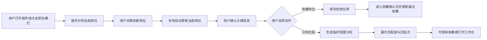
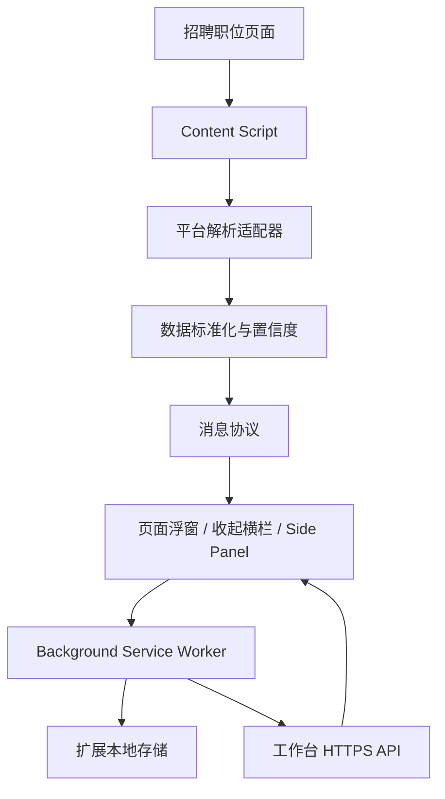

# 秋招求职工作台浏览器插件功能与技术设计文档

## 1. 文档信息

| 项目 | 内容 |
| --- | --- |
| 文档版本 | V0.5 |
| 对应产品文档 | 《秋招求职工作台产品需求文档 V0.5》 |
| 对应设计文档 | 《秋招求职工作台 UI 设计文档 V0.6》 |
| 插件定位 | 识别、收藏或分析当前岗位，并衔接 Web 求职工作流 |
| 首发平台 | BOSS 直聘职位详情页 |
| 首发浏览器 | Chrome、Microsoft Edge |
| 后续浏览器 | Firefox、Safari、其他 Chromium 浏览器 |
| 决策记录 | [产品决策记录](./产品决策记录.md) |
| 更新日期 | 2026-08-18 |

## 2. 结论摘要

插件 UI 以效果图和当前可运行 Demo 的确认结果共同作为实现基线。当前岗位、匹配结果、收藏完成和识别失败均采用单列纵向结构；默认承载于招聘页面内常驻浮窗，用户可在设置中切换为浏览器侧边栏，两种方式复用同一页面和状态。

插件可以使用一套核心代码支持主流桌面浏览器，但需要为不同浏览器生成不同构建产物，不能发布一个完全通用的安装包。

- Chrome、Edge、Brave、Opera 等 Chromium 浏览器可以高度复用同一个 Manifest V3 构建。
- Firefox 支持 WebExtensions，但原生侧栏使用 `sidebar_action/sidebarAction`，与 Chrome 的 `side_panel/sidePanel` 不兼容，需要薄适配层。[Firefox 兼容性说明](https://developer.mozilla.org/en-US/docs/Mozilla/Add-ons/WebExtensions/Chrome_incompatibilities)
- Safari Web Extension 可以复用 JavaScript、HTML、CSS 和常见扩展文件，但需要通过 Xcode 打包为 Apple 平台应用扩展并单独分发。[Safari Web Extensions](https://developer.apple.com/documentation/safariservices/safari-web-extensions?changes=_5)
- 各浏览器需要分别测试、签名、打包并提交各自商店。

推荐策略：

1. 第一版正式支持 Chrome。
2. 同步验证 Edge，通常可以直接复用 Chromium 构建；微软也说明多数 Chromium 扩展可以少量修改或直接迁移。[Edge 扩展概览](https://learn.microsoft.com/en-us/microsoft-edge/extensions/)
3. 项目从第一天使用跨浏览器 API 封装和多 Manifest 构建。
4. 第二阶段发布 Firefox。
5. 产品验证后再投入 Safari 打包、签名和商店审核。

## 3. 插件产品定位

### 3.1 核心价值

用户浏览招聘平台时，不离开当前页面即可将岗位保存到自己的工作台，后续在 Web 工作台完成：

- JD 解读。
- 职业档案匹配。
- 定制招呼语。
- 定制简历。
- 加入求职 Tracker。
- 查看岗位五阶段工作流和建议下一步。
- 面试准备和复盘。

### 3.2 首版功能边界

插件承担岗位识别、收藏、轻量分析、结果查看和 Web 工作台入口，不承担完整求职工作台。插件打开期间可以自动识别用户新打开的当前岗位，但识别结果只保存在本地；用户点击“收藏岗位”或“分析匹配”之前，不向工作台上传 JD，也不创建服务端记录。“准备投递材料”“查看 JD 解读”“生成定制招呼语”“加入投递看板”等操作只负责打开 Web 工作台的对应页面。

插件首版不包含：

- 后台自动搜索或持续抓取岗位。
- 自动翻页、自动滚动或批量采集。
- 自动投递、自动打招呼或自动发送简历。
- 读取用户招聘平台 Cookie、聊天记录或招聘者联系方式。
- 自动读取招聘者已读、回复或后台特征。
- 在插件内编辑完整简历。
- 在插件内执行深度职业档案问答。
- 在插件内展示完整驾驶舱、完整 JD 解读或复杂分析。

## 4. 核心用户流程



### 4.1 首次使用

1. 用户安装插件。
2. 点击浏览器工具栏中的插件图标。
3. 插件在支持的职位页打开默认浮窗；非支持页面回退到侧边栏，并提示连接求职工作台。
4. 用户完成登录或账号绑定。
5. 插件显示“已连接工作台”。
6. 用户进入支持的职位详情页开始收藏。

### 4.2 日常收藏

1. 用户正常打开 BOSS 职位详情页。
2. 插件打开期间识别当前页面 URL 和 DOM 变化。
3. 用户切换到新的职位详情时，浮窗或收起栏在本地自动更新当前岗位，但不得自动从收起状态展开。
4. 用户检查职位、公司、城市、薪资和方向。
5. 用户可以点击“收藏岗位”或“分析匹配”，两个动作彼此独立。
6. 点击“收藏岗位”时，插件保存结构化岗位数据和原始 JD，但不自动触发分析。
7. 点击“分析匹配”时，插件上传分析所需的岗位字段并生成临时分析，但不自动加入岗位库。
8. 插件展示相应的收藏状态，或匹配度、AI 岗位总结、已有技能和需要改进的技能。
9. 用户可以在分析后继续收藏；收藏时复用并关联已有分析结果。
10. 用户可以继续浏览、打开工作台总览或进入已收藏岗位详情。

## 5. 插件功能需求

### EXT-001 工作台连接

- 显示当前连接的工作台账号。
- 未登录时提供“连接工作台”按钮。
- 登录成功后返回原职位页，不丢失已识别岗位。
- 支持退出账号和重新连接。
- 不使用或转存招聘平台登录状态。

#### Demo 阶段

可以使用固定测试账号或一次性配对码，减少正式 OAuth 开发成本。

#### 外部测试阶段

使用浏览器身份授权或基于 Web 登录的一次性授权码：

```text
插件生成 state 和 PKCE 参数
→ 打开工作台登录页
→ 用户完成登录
→ 工作台签发一次性 code
→ 插件换取短期 access token
```

### EXT-002 当前页面识别

- 判断当前 URL 是否属于支持平台。
- 判断当前页面是否为职位详情页。
- 仅在插件处于打开状态时监听当前标签页。
- 页面通过前端路由切换到新岗位时自动重新识别。
- 页面内容异步加载完成后自动更新结果。
- 识别过程不修改招聘页面内容。
- 自动识别只产生本地临时草稿，不自动上传、收藏或触发分析。
- 收起状态下继续监听当前标签页的 URL 和必要 DOM 变化，但只更新本地岗位草稿，不自动展开面板。

### EXT-003 岗位字段提取

首版提取：

| 字段 | 必填 | 说明 |
| --- | --- | --- |
| source | 是 | `boss` |
| sourceUrl | 是 | 当前职位原始链接 |
| title | 是 | 职位名称 |
| company | 是 | 公司名称 |
| companyLogoUrl | 否 | 与当前职位公司名称来自同一公司信息卡的 Logo URL，失败时使用平台通用职位图标 |
| salaryText | 否 | 保留原始薪资描述 |
| locationText | 否 | 城市和工作地点 |
| experienceText | 否 | 经验要求 |
| educationText | 否 | 学历要求 |
| jobDescription | 是 | 当前岗位完整 JD |
| skillTags | 否 | 页面展示的技能标签 |
| companyDescription | 否 | 当前页面明确展示的公司摘要 |
| capturedAt | 是 | 用户收藏时刻 |
| parserVersion | 是 | 解析器版本 |

不采集：

- 招聘者姓名、头像和联系方式。
- 聊天内容。
- 用户招聘平台账号信息。
- Cookie、Token 和设备指纹。
- 当前岗位之外的推荐列表。

公司名称和 Logo 必须成对从“当前职位公司卡片”提取，不允许分别从页面全局查找后拼接。解析器应排除地图、地点缩略图、招聘者头像、学校图标、推荐职位卡片和公司列表图片；候选 Logo 必须与当前公司容器具有关联，并通过尺寸、容器语义、链接目标和图片来源等规则校验。不能可靠确认时，保留已确认的公司文字并回退到通用职位图标，禁止为了有图而显示地图或错误公司 Logo。

### EXT-004 单列界面与打开方式

插件提供两种打开方式，默认值为“页面弹出浮窗”：

- 浏览器侧边栏：由原生 Side Panel 承载。
- 页面弹出浮窗：由 Content Script 在受支持的招聘页面中注入 Shadow DOM 隔离容器，并通过扩展页面 iframe 承载同一套界面。

两种方式均使用单列纵向界面，顺序固定为“顶部账号栏—主状态区—收藏区—打开完整工作台”。支持页面默认注入浮窗容器；关闭后不显示，用户点击插件图标可重新打开；非支持页面自动回退到侧边栏。

浮窗交互：

- 默认展开尺寸为 420 × 620px，可通过右下角拖动调整大小。
- 收起后保留会议软件风格的横向悬浮栏；栏和展开浮窗都可以拖动。
- 收起栏与展开浮窗共用同一位置，顶部 `•••` 是唯一主拖动锚点并始终水平居中；展开/收起时锚点的屏幕位置保持不动。
- 允许面板大部分移出视口为原页面留出空间，但 `•••` 把手必须始终完整留在视口内。
- 悬停、首次鼠标移入、页面加载和岗位切换均不得自动展开，只有点击横栏才展开。
- 收起与关闭使用紧凑、低对比度的 macOS/SF Symbols 语义组合按钮，避免大圆形按钮抢占视觉层级。
- 调整大小时使用 `requestAnimationFrame` 合并更新，并暂停 iframe 内部内容重排；松手后提交最终尺寸和恢复布局。

顶部账号栏：

- 显示产品名称、工作台连接状态、头像和账号菜单。
- 未连接时将连接工作台作为主要操作。
- 使用第二版简洁平台 Logo，不在收起横栏重复显示产品文字。
- 功能图标采用 SF Symbols 的语义和轻量视觉语言；Web/非 Apple 平台使用视觉一致且可合法分发的矢量替代。

主状态区根据当前任务切换：

- 新岗位：展示岗位摘要、AI 岗位总结 Demo、“收藏岗位”和灰色待分析的“分析匹配”两个独立按钮。
- 匹配结果：展示收藏状态、匹配度、投递建议、已有/匹配技能、不具备/需要改进技能和 Web 端后续操作入口。
- 收藏成功：使用独立确认页展示成功反馈、岗位摘要、三个后续入口和继续浏览操作。
- 分析中：展示匹配进度，不阻塞用户继续浏览。
- 识别失败：展示重新识别、手动粘贴 JD、可能原因和隐私说明。

收藏区位于主状态区下方：

- 当前岗位和识别失败页展示“最近收藏”纵向列表，默认三条。
- 匹配结果页展示“我的收藏”横向卡片列表，默认露出三至四条并支持横向滚动。
- 收藏成功页展示“刚刚收藏”摘要卡。
- 点击收藏项打开 Web 工作台岗位详情；“查看全部”或“管理”打开 Web 岗位库。

### EXT-005 岗位摘要预览

收藏前展示：

- 职位名称。
- 公司名称。
- 城市。
- 薪资。
- 系统识别的求职方向。

用户可以修改求职方向；其他字段识别错误时可以选择“在工作台补充”，不在插件中加入复杂编辑表单。

岗位卡顶部采用“公司 Logo—岗位与公司—薪资”结构。薪资胶囊与岗位名称顶线对齐，文字不换行并保留足够内边距；岗位标题使用可收缩区域和省略号，不能通过压缩薪资文字解决空间不足。

### EXT-006 求职方向分类

首版方向：

- 技术研发。
- 产品。
- 数据与算法。
- 运营。
- 设计。
- 暂未分类。

优先使用职位名称和页面标签进行本地规则分类；无法判断时由服务端模型分类。用户的手动选择具有最高优先级。

### EXT-007 收藏岗位与分析匹配

#### 收藏岗位

- 用户点击“收藏岗位”后，岗位数据才写入个人岗位库。
- 收藏不自动触发匹配分析。
- 成功后保存服务端返回的 `jobId`，进入收藏确认页并刷新最近收藏数据。
- 已有临时分析时，将 `analysisId` 关联到岗位，不重复计算。

#### 分析匹配

- 用户点击“分析匹配”后，插件才上传分析所需的岗位字段。
- 分析不自动收藏岗位，也不让该岗位出现在收藏列表。
- 服务端返回 `analysisId`；分析完成后展示轻量结果。
- 未收藏分析默认作为临时记录保留 24 小时，用户收藏后转为岗位正式分析。

两个按钮分别维护加载状态，网络失败时保留本地岗位草稿并允许单独重试。

### EXT-008 重复识别

重复判断分两层：

1. 插件本地根据标准化 URL 查询最近收藏缓存。
2. 服务端根据来源、标准化 URL 和平台职位标识判断。

如果已经收藏：

- 展示收藏时间。
- 不创建重复岗位。
- 提供“打开岗位详情”。
- 允许用户请求重新同步当前 JD，但服务端保留变更记录。

### EXT-009 轻量岗位分析

轻量分析必须由用户点击灰色“分析匹配”后触发。Demo 阶段不进行真实模型识别，插件展示固定模拟结果并明确标注 Demo；正式阶段由工作台服务端完成，插件只展示结果。内容包括：

- 0—100 的匹配度分数。
- 优先投递、有条件投递或暂不建议。
- 一至两句 AI 岗位总结，不展示完整岗位简介或完整 JD。
- 已有/匹配技能及其职业档案证据。
- 不具备/需要改进技能及缺失原因。

插件不展示完整评分权重、完整 JD 拆解、全部能力缺口和简历生成内容；“准备投递材料”和“打开岗位详情”均进入 Web 工作台对应页面。

### EXT-010 收藏成功

收藏成功状态展示：

- 勾选成功图标、“岗位已收藏”和“已加入你的岗位库”。
- 岗位名称、公司、薪资、地点、经验、学历和“待判断”状态。
- “查看 JD 解读”“生成定制招呼语”“加入投递看板”三个 Web 工作台入口。
- 展示当前工作流阶段“岗位分析”和一个建议下一步；完整任务清单在 Web 工作台完成。
- “查看岗位详情”和“继续浏览职位”两个主要操作。
- “刚刚收藏”同步状态卡和“打开完整工作台”入口。

用户切换到下一个职位后，插件自动回到当前岗位识别状态。

### EXT-011 最近收藏岗位

- 插件打开后获取最近收藏岗位；当前岗位和识别失败页默认展示三条，匹配结果页以横向卡片展示三至四条。
- 按收藏时间倒序排列。
- 列表加载失败不影响当前岗位识别和收藏。
- 点击岗位列表项打开 `/jobs/{jobId}`。
- 点击“查看全部”或“管理”打开岗位库；点击“打开完整工作台”打开总览页。
- 插件不加载完整岗位库和复杂筛选。

### EXT-012 打开工作台

插件能够打开：

- 工作台总览。
- 当前岗位详情：`/jobs/{jobId}`。
- 当前岗位工作流：`/jobs/{jobId}/workflow`。
- 当前岗位投递准备：`/jobs/{jobId}/preparation`。
- 当前岗位面试准备：`/jobs/{jobId}/interview`。
- 登录连接页面。
- 帮助与隐私说明。

默认复用已有工作台标签页；没有时创建新标签页。

### EXT-013 设置与诊断

设置页面包含：

- 打开方式：页面弹出浮窗或浏览器侧边栏，默认浮窗。
- 浮窗位置、展开尺寸和收起状态。
- 当前账号。
- API 环境和版本信息。
- 插件版本。
- 已授权的网站范围。
- 清除本地缓存。
- 退出登录。
- 隐私说明。
- 复制诊断信息。

诊断信息不得包含简历内容、完整 JD、访问 Token 或招聘平台账号数据。

## 6. 页面与状态

### 6.1 未连接

```text
秋招工作台

连接你的工作台后，即可将当前岗位一键收藏。

[连接工作台]
```

### 6.2 正在识别

- 显示骨架屏。
- 文案：“正在识别当前岗位”。
- 超过三秒展示“重新识别”。

### 6.3 识别成功

```text
求职工作台                         ● 已连接

当前岗位 · BOSS直聘
┌──────────────────────────────────┐
│ Web前端工程师            8—13K   │
│ 酷巢科技 · 杭州 · 1—3年 · 本科   │
│ HTML/CSS  JavaScript  Node.js    │
│ AI 岗位总结                       │
│ [收藏岗位]       [灰色·分析匹配]  │
└──────────────────────────────────┘

最近收藏                         查看全部
产品助理 / 数据分析师 / 前端开发实习生

打开完整工作台
```

此时主状态区只展示本地提取的岗位预览，不展示云端匹配度。点击“收藏岗位”只保存岗位；点击“分析匹配”才触发分析，两个动作均不会自动触发另一个动作。

### 6.4 未识别

原因可能包括：

- 当前页面不是职位详情页。
- 页面仍在加载。
- 页面结构发生变化。
- 当前网站尚未支持。

操作：

- 重新识别。
- 手动粘贴 JD。
- 查看可能原因与隐私说明。
- 浏览最近收藏或打开完整工作台。

### 6.5 匹配结果

```text
已收藏                         82 匹配度
                              值得投递

AI 岗位总结
负责核心业务功能与跨团队协作……

已有 / 匹配技能
✓ JavaScript  ✓ React  ✓ 项目协作

不具备 / 需要改进
! Node.js 项目证据  ! 性能优化案例

[准备投递材料]
[重新分析] [打开岗位详情]

我的收藏（横向卡片）
```

“准备投递材料”和“打开岗位详情”打开 Web 工作台；插件不在当前页编辑简历或生成完整材料。若岗位尚未收藏，则顶部显示“未收藏”并保留“收藏岗位”操作。

### 6.6 收藏成功

收藏完成后进入独立确认页，展示成功反馈、岗位摘要、三个后续入口、“查看岗位详情”“继续浏览职位”、刚刚收藏同步状态和完整工作台入口。三个后续入口均打开 Web 工作台相应页面。

### 6.7 网络失败

- 显示失败原因和重试按钮。
- 岗位草稿暂存在本地。
- 网络恢复后由用户主动重新提交，首版不在后台静默上传。

## 7. 技术架构



### 7.1 推荐框架

推荐使用：

```text
WXT + React + TypeScript + Tailwind CSS
```

原因：

- WXT 提供 Chrome、Firefox、Edge、Safari 和 Chromium 浏览器的多目标构建能力。[WXT 浏览器支持](https://wxt.dev/)
- 它通过统一的 `browser` 入口兼容 `chrome.*` 和 `browser.*` Promise 风格 API。[WXT Extension APIs](https://wxt.dev/guide/essentials/extension-apis)
- 支持针对浏览器和 Manifest 版本分别构建，允许排除特定入口和加入条件代码。[WXT 多浏览器构建](https://wxt.dev/guide/essentials/target-different-browsers)
- 与 React、TypeScript 和 Vite 工具链兼容。

WXT 只能减少工程配置，不能消除浏览器 API 差异。侧栏、登录授权和商店发布仍需平台适配。

### 7.2 项目结构

```text
apps/extension/
├── entrypoints/
│   ├── background.ts
│   ├── content.ts
│   ├── sidepanel/
│   │   ├── index.html
│   │   └── App.tsx
│   ├── popup/
│   │   ├── index.html
│   │   └── App.tsx
│   └── options/
├── src/
│   ├── adapters/
│   │   ├── types.ts
│   │   └── boss.ts
│   ├── browser-shell/
│   │   ├── types.ts
│   │   ├── chromium.ts
│   │   ├── firefox.ts
│   │   └── safari.ts
│   ├── api/
│   ├── auth/
│   ├── messaging/
│   ├── storage/
│   ├── components/
│   └── styles/
├── public/
├── fixtures/
└── wxt.config.ts
```

### 7.3 Content Script

职责：

- 读取当前页面 DOM。
- 监听单页应用路由和岗位内容变化。
- 调用平台解析适配器。
- 返回结构化岗位草稿。

不负责：

- 调用 AI。
- 保存服务端数据。
- 管理身份 Token。
- 绕过页面限制。

### 7.4 Background Service Worker

职责：

- 管理扩展生命周期。
- 打开对应浏览器 UI 容器。
- 保存短期登录状态和岗位草稿。
- 调用工作台 API。
- 处理标签页和侧边栏之间的消息。

Manifest V3 使用按需运行的 service worker，不能假设后台脚本永久存活；状态必须落入扩展存储或服务端。Chrome MV3 也要求扩展执行代码随安装包一起发布，不能加载远程脚本。[Chrome Manifest V3](https://developer.chrome.com/docs/extensions/develop/migrate/what-is-mv3)

### 7.5 UI 容器适配

定义统一接口：

```ts
interface BrowserShell {
  openCollector(tabId?: number): Promise<void>;
  closeCollector(tabId?: number): Promise<void>;
  openWorkbench(path: string): Promise<void>;
  getActiveTab(): Promise<BrowserTab | null>;
}
```

各浏览器实现：

| 浏览器 | 首选 UI | 适配方式 |
| --- | --- | --- |
| Chrome | 页面浮窗；Side Panel 备选 | Content Script 浮窗为默认，`chrome.sidePanel` 作为设置项，Chrome 114+、MV3。[官方文档](https://developer.chrome.com/docs/extensions/reference/api/sidePanel) |
| Edge | 页面浮窗；Chromium Side Panel 备选 | 优先复用 Chrome 构建，实际发布前测试 API 支持 |
| Brave/Opera | 页面浮窗；Popup/Side Panel 备选 | 复用 Chromium 构建，按浏览器测试 |
| Firefox | 原生 Sidebar | `sidebar_action` 和 `browser.sidebarAction`。[官方文档](https://developer.mozilla.org/en-US/docs/Mozilla/Add-ons/WebExtensions/manifest.json/sidebar_action) |
| Safari | Popup 或页面内抽屉兜底 | 复用 WebExtension 核心代码，通过 Xcode 打包；具体 UI 按 Safari API 支持适配 |

Chrome 的 `sidePanel` 与 Firefox 的 `sidebarAction` 并非兼容 API，必须通过上面的抽象层隔离。[Firefox sidebarAction 说明](https://developer.mozilla.org/en-US/docs/Mozilla/Add-ons/WebExtensions/API/sidebarAction)

### 7.6 平台解析适配器

```ts
interface JobPageAdapter {
  id: string;
  version: string;
  matches(input: { url: string; document: Document }): boolean;
  extract(document: Document): JobDraft;
}

interface JobDraft {
  source: "boss";
  sourceUrl: string;
  title: FieldResult<string>;
  company: FieldResult<string>;
  companyLogoUrl?: FieldResult<string>;
  salaryText?: FieldResult<string>;
  locationText?: FieldResult<string>;
  experienceText?: FieldResult<string>;
  educationText?: FieldResult<string>;
  jobDescription: FieldResult<string>;
  skillTags: FieldResult<string[]>;
}

interface FieldResult<T> {
  value: T;
  confidence: number;
  sourceSelector?: string;
}
```

解析适配器必须独立于 UI 和 API，方便页面变更时单独修复和测试。

### 7.7 单页应用页面变化

BOSS 等网站可能通过前端路由切换职位而不刷新页面。插件需要监听：

- URL 变化。
- `history.pushState/replaceState` 导航结果。
- DOM 关键区域变化。
- 当前标签页激活状态。

使用 `MutationObserver` 时必须：

- 只观察岗位详情容器或有限根节点。
- 设置 300—500ms 防抖。
- 计算当前 URL 与页面内容指纹，避免重复解析。
- 侧边栏关闭时减少不必要监听。

## 8. 消息协议

使用带版本和类型的消息：

```ts
type ExtensionMessage =
  | { version: 1; type: "JOB_DETECT_REQUEST"; tabId: number }
  | { version: 1; type: "JOB_DETECTED"; payload: JobDraft }
  | { version: 1; type: "JOB_NOT_DETECTED"; reason: string }
  | { version: 1; type: "JOB_SAVE_REQUEST"; payload: JobSaveInput }
  | { version: 1; type: "JOB_SAVED"; jobId: string; duplicate: boolean }
  | { version: 1; type: "JOB_ANALYZE_REQUEST"; payload: JobAnalyzeInput }
  | { version: 1; type: "JOB_ANALYSIS_STARTED"; analysisId: string }
  | { version: 1; type: "JOB_ANALYSIS_READY"; payload: JobAnalysisSummary }
  | { version: 1; type: "RECENT_JOBS_UPDATED"; payload: RecentJob[] }
  | { version: 1; type: "AUTH_CHANGED"; authenticated: boolean };
```

所有消息必须通过运行时 Schema 校验，不能信任来自页面上下文的数据。

## 9. 工作台 API

### 9.1 收藏岗位

```http
POST /api/extension/jobs
Authorization: Bearer <access-token>
Content-Type: application/json
```

请求：

```json
{
  "source": "boss",
  "sourceUrl": "https://www.zhipin.com/job_detail/...",
  "title": "产品经理",
  "company": "某某科技",
  "salaryText": "20K-30K",
  "locationText": "上海",
  "jobDescription": "...",
  "direction": "product",
  "capturedAt": "2026-08-17T14:30:00+08:00",
  "parserVersion": "boss-1.0.0"
}
```

响应：

```json
{
  "jobId": "job_123",
  "duplicate": false,
  "workbenchUrl": "https://app.example.com/jobs/job_123"
}
```

如果用户已经完成临时分析，收藏请求可以附带 `analysisId`，服务端将分析关联到新岗位。

### 9.2 查询是否收藏

```http
GET /api/extension/jobs/lookup?source=boss&url=<encoded-url>
```

已收藏时同时返回 `jobId`、收藏时间、分析状态和已缓存的轻量分析摘要，避免重复计算。

### 9.3 最近收藏岗位

```http
GET /api/extension/jobs/recent?limit=10
```

响应仅包含侧栏列表所需字段：`jobId`、职位、公司、Tracker 状态、匹配度、收藏时间和工作台 URL，不返回完整 JD。

### 9.4 创建轻量分析

```http
POST /api/extension/job-analyses
Authorization: Bearer <access-token>
Content-Type: application/json
```

请求包含当前岗位必要字段和可选 `jobId`。没有 `jobId` 时创建临时分析，不创建岗位库记录；已有 `jobId` 时将结果直接关联到该岗位。

### 9.5 获取轻量分析

```http
GET /api/extension/job-analyses/{analysisId}
```

当分析仍在进行时返回 `analysisStatus: "queued" | "processing"`；完成时返回匹配度、投递建议、AI 岗位总结、匹配技能及证据、需要改进技能及原因。Demo 可以在前端返回固定 Schema 数据，但必须保留相同字段，方便后续替换为服务端结果。

正式 AI 服务统一使用 `deepseek-v4-flash`，API Key 仅保存在工作台服务端。岗位总结使用非思考模式；匹配与技能差距分析使用思考模式。服务端必须校验 JSON、处理空响应并最多自动重试一次，插件不得直连 DeepSeek。

Demo 可每 2 秒轮询一次，最多 30 秒；正式版优先使用 SSE 或带退避的状态查询。

### 9.6 重新同步

```http
POST /api/extension/jobs/{jobId}/refresh
```

服务端更新 JD 前保存内容哈希和变更时间，不直接覆盖历史数据。

## 10. 本地存储

建议使用 `browser.storage.local` 保存：

- 当前工作台环境。
- 短期 access token 或授权会话标识。
- 最近收藏 URL 与 `jobId` 缓存。
- 收藏失败的临时岗位草稿。
- 用户设置和匿名诊断选择。

不保存：

- 招聘平台 Cookie。
- 完整职业档案。
- 原始简历。
- 长期完整岗位库。
- 模型生成结果。

## 11. 权限设计

### 11.1 Chromium 首版权限

```json
{
  "manifest_version": 3,
  "permissions": [
    "activeTab",
    "storage",
    "sidePanel"
  ],
  "host_permissions": [
    "https://www.zhipin.com/*",
    "https://api.example.com/*"
  ]
}
```

如 Content Script 只在 BOSS 页面静态注册，可以不请求宽泛的全站访问权限。

### 11.2 权限原则

- 不申请 `cookies`。
- 不申请浏览历史。
- 不申请所有网站访问权限 `<all_urls>`。
- 不拦截或修改网络请求。
- 不在用户未操作时上传页面内容。
- 新增招聘平台时按域名逐项申请权限。

## 12. 安全与隐私

### 12.1 页面数据安全

- Content Script 输出必须经过 Schema 校验和文本长度限制。
- 从 JD 中提取的 HTML 必须转为纯文本或安全清洗后再展示。
- 不将页面 HTML 直接写入工作台。
- 不执行来自招聘页面或服务端返回的脚本。

### 12.2 身份安全

- 所有 API 使用 HTTPS。
- Token 设置较短有效期并可由服务端撤销。
- 扩展存储中的 Token 不写入日志。
- 登录回调使用 `state` 和 PKCE 防止授权劫持。
- 用户退出时清理本地身份和缓存。

### 12.3 扩展内容安全策略

- 所有可执行代码随扩展安装包发布。
- 不从 CDN 加载远程 JavaScript。
- 不使用 `eval` 和动态代码执行。
- UI 字体和图标尽量随包发布。

### 12.4 用户控制

- 明确展示将要保存的字段。
- 收藏必须由用户点击触发。
- 允许删除工作台中的岗位。
- 匿名错误上报默认最小化，包含页面结构指纹而非完整 JD。

## 13. 跨浏览器实现方案

### 13.1 共享部分

预计可以共享：

- React 侧栏 UI。
- BOSS 页面解析适配器。
- 数据 Schema 和标准化逻辑。
- 工作台 API 客户端。
- 登录业务流程。
- 本地缓存逻辑。
- 消息协议。
- 单元测试和页面 Fixture。

### 13.2 浏览器差异部分

需要分别处理：

- 侧边栏打开和关闭 API。
- Manifest 字段和 Manifest 版本。
- Background service worker 与 background script 生命周期。
- 登录回调 API。
- 扩展商店签名和发布。
- Safari 的 Xcode 工程与 Apple 签名。
- 部分浏览器的侧栏尺寸和交互限制。

### 13.3 构建产物

```text
dist/
├── chrome-mv3.zip
├── edge-mv3.zip
├── firefox.zip
└── safari-source/
```

Safari 源码产物再通过 Xcode 工具转换、签名和打包。

### 13.4 UI 降级策略

默认及降级顺序：

1. 支持招聘页面上的 Shadow DOM + iframe 浮窗。
2. 浏览器原生 Side Panel/Sidebar。
3. 工具栏 Popup。

页面内抽屉只作为兼容兜底，使用 Shadow DOM 隔离样式，并保证不遮挡招聘页面关键操作。

## 14. 测试方案

### 14.1 单元测试

- URL 标准化。
- 求职方向规则分类。
- 字段清洗。
- 消息 Schema。
- API 错误映射。
- 权限与使用范围逻辑。

### 14.2 解析器 Fixture

为 BOSS 页面保存脱敏 DOM Fixture：

```text
fixtures/boss/
├── job-standard.html
├── job-missing-salary.html
├── job-long-description.html
├── job-spa-navigation-a.html
└── job-spa-navigation-b.html
```

每次修改适配器都运行快照测试，确保字段没有意外消失。

### 14.3 端到端测试

验证：

1. 打开测试职位页面。
2. 插件在本地自动识别岗位，但不产生上传请求。
3. 用户点击“分析匹配”，API 创建临时分析但岗位不进入收藏列表。
4. 插件显示分析中，随后显示轻量匹配结果。
5. 用户点击“收藏岗位”，API 创建岗位但不重复触发分析。
6. 收藏完成页展示“刚刚收藏”同步状态，并关联已有分析结果。
7. 点击收藏项打开工作台对应岗位。
8. 重复收藏返回已收藏及关联分析。

自动测试优先覆盖 Chromium 和 Firefox；Safari 在 Xcode/Safari 环境中进行独立手动回归。

### 14.4 真实页面回归

- 每周对少量公开职位详情页执行人工回归。
- 不使用高频自动化访问生产招聘网站。
- 解析失败率异常时关闭收藏按钮并提供粘贴 JD 兜底。

## 15. 可观测性

记录：

- 插件版本和浏览器版本。
- 解析器版本。
- 是否成功识别必填字段。
- 收藏请求成功率和耗时。
- API 错误码。
- 不包含页面原文的 DOM 结构指纹。

不记录：

- 完整 JD 日志。
- 招聘平台账号数据。
- Access Token。
- 用户简历和职业档案。

核心指标：

- 职位详情页识别成功率。
- 收藏提交成功率。
- 重复收藏率。
- 收藏后打开工作台比例。
- 各插件版本解析失败率。

## 16. 发布策略

### 阶段一：开发和内部 Demo

- Chrome 解压加载。
- 测试 API 环境。
- 固定 Demo 用户。
- 支持一个 BOSS 页面结构。

### 阶段二：封闭测试

- Chrome 测试版安装包。
- 正式工作台登录。
- 错误监控和解析器版本控制。
- 10—30名测试用户。

### 阶段三：Chromium 发布

- Chrome Web Store。
- Microsoft Edge Add-ons。
- 独立隐私政策和权限说明。
- 商店截图、审核材料和用户支持渠道。

### 阶段四：跨浏览器

- Firefox AMO 构建和审核。
- Safari Xcode 工程、Apple 签名和商店分发。
- Brave、Opera 等 Chromium 浏览器兼容性测试。

## 17. Demo 验收标准

1. 插件可以在 Chrome 的 BOSS 职位页默认打开 420 × 620 浮窗，并可在设置中切换 Side Panel。
2. 插件可以连接工作台测试账号。
3. 当前岗位和识别失败页能够加载最近三条收藏；匹配结果页能够加载横向“我的收藏”卡片。
4. 插件打开期间，切换到新的 BOSS 职位详情页会自动更新主状态区的本地预览。
5. 用户点击任一操作前展示职位、公司、城市、薪资和方向，且不上传完整 JD。
6. 用户可以修正岗位方向，并分别看到“收藏岗位”和“分析匹配”。
7. 点击“收藏岗位”后岗位写入工作台数据库，但不自动启动分析。
8. 分析按钮默认灰色且悬停不触发；用户点击后展示 Demo 匹配度、AI 岗位总结、已有技能和需要改进技能，但岗位不自动进入收藏列表。
9. 收藏成功后进入独立确认页，展示岗位摘要、当前工作流阶段、建议下一步、Web 后续入口、“查看岗位详情”“继续浏览职位”和“刚刚收藏”同步状态。
10. 点击收藏项进入正确的工作台岗位详情；“查看全部/管理”进入岗位库，“打开完整工作台”进入总览页。
11. 同一 URL 再次收藏时显示已收藏及已有分析（如有），不创建重复记录。
12. 网络失败后可以重试，已提取岗位不会丢失。
13. 插件不读取招聘平台 Cookie、聊天、招聘者或联系人信息。
14. 识别失败页展示重新识别、手动粘贴 JD、可能原因、隐私说明和最近收藏。
15. 收起后保留可拖动横栏且不因岗位切换自动展开；关闭后完全隐藏，点击插件图标可重新打开；Chrome 构建可在 Edge 完成基本验证。
16. 收起栏与展开浮窗共享位置，`•••` 始终居中并保持锚点位置；面板移出视口时把手仍完整可见。
17. 默认尺寸为 420 × 620，调整大小过程无明显卡顿。
18. 公司名称与 Logo 成对识别，地图和推荐职位图片不会被误用为当前公司 Logo；失败时回退通用图标。

## 18. 首版开发任务拆分

### 插件底座

- 初始化 WXT、React 和 TypeScript。
- 配置 Chrome/Edge 构建。
- 创建页面浮窗/收起横栏、Side Panel、Background 和 Content Script 入口。
- 建立共享 UI 和消息协议。

### BOSS 解析

- URL 和详情页识别。
- 职位字段选择器。
- DOM 清洗和字段标准化。
- SPA 导航监听。
- 解析器 Fixture 和单元测试。

### 工作台连接

- Demo Token。
- 收藏岗位 API。
- 创建与查询轻量分析 API。
- 重复查询 API。
- 最近收藏岗位 API。
- 打开岗位详情。
- 错误处理和重试。

### 跨浏览器准备

- 所有扩展调用通过 `browser` 统一入口。
- 建立 `BrowserShell` 适配层。
- Manifest 不直接散落在业务代码中。
- 添加 Edge 基础验证。
- 保留 Firefox Sidebar 入口结构。

## 19. 待确认事项

1. Side Panel 备选能力的最低 Chrome 版本是否定为 114？建议确认；默认浮窗不依赖 Side Panel 打开手势。
2. Edge 首版是否作为正式支持浏览器，还是只做兼容性验证？
3. 岗位方向是收藏前必须确认，还是允许直接使用系统默认？建议展示默认值但不强制额外点击。
4. 是否允许用户发送匿名解析失败报告？建议默认询问，不自动上传完整页面。
5. Safari 是否需要进入第一版目标？建议不进入，先预留架构。
